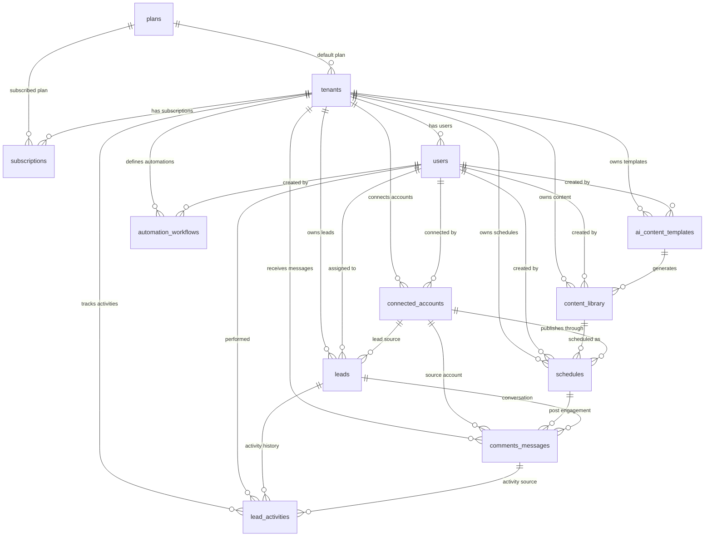

# Database Design

BizPilot AI will use MySQL as the primary database.

The MVP uses a shared-database multi-tenant model. Tenant-owned tables must include `tenant_id` and every application query must be scoped by the authenticated user's tenant context.

Auth foundation migrations now exist for `users`, `password_reset_tokens`, `sessions`, and Sanctum `personal_access_tokens`.

Tenant foundation migrations now exist for `plans`, `tenants`, and `users.tenant_id`. Remaining MVP schema tables are still design-only until their modules are implemented.

Scheduler foundation migrations now exist for `jobs`, `job_batches`, `failed_jobs`, and `schedules`.

Lead CRM migrations now exist for `leads` and `lead_activities`.

## Conventions

- Primary keys use `bigint` auto-increment IDs unless noted otherwise.
- Foreign keys use `foreignId` / `bigint unsigned` style when implemented in Laravel.
- Timestamps use `created_at` and `updated_at`.
- Soft deletes use `deleted_at` only where recovery or audit value is expected.
- Flexible provider payloads use MySQL `json`.
- Money values should be stored in integer minor units, such as cents or paise.
- Tenant-owned tables must include an index on `tenant_id`.

## Tables

### plans

Purpose: Stores available SaaS pricing plans and product limits.

Columns:

| Column | Type | Constraints | Notes |
| --- | --- | --- | --- |
| `id` | bigserial | Primary key | Plan identifier |
| `name` | varchar(100) | Not null | Human-readable plan name |
| `slug` | varchar(100) | Not null, unique | Stable plan key, such as `starter` |
| `description` | text | Nullable | Plan description |
| `price_amount` | integer | Not null, default 0 | Price in minor currency unit |
| `currency` | char(3) | Not null, default `USD` | ISO currency code |
| `billing_interval` | varchar(20) | Not null | Example: `monthly`, `yearly` |
| `max_users` | integer | Nullable | Null means unlimited |
| `max_connected_accounts` | integer | Nullable | Null means unlimited |
| `max_scheduled_posts` | integer | Nullable | Limit per billing period or active schedule count |
| `max_ai_generations` | integer | Nullable | Limit per billing period |
| `features` | json | Not null | Feature flags and limits |
| `is_active` | boolean | Not null, default true | Whether plan is available |
| `sort_order` | integer | Not null, default 0 | UI display order |
| `created_at` | timestamp | Not null | Created timestamp |
| `updated_at` | timestamp | Not null | Updated timestamp |

Indexes:

- Primary key: `id`
- Unique index: `slug`
- Index: `is_active`
- Index: `sort_order`

Foreign keys:

- None

### tenants

Purpose: Represents each business workspace/customer account in the SaaS platform.

Columns:

| Column | Type | Constraints | Notes |
| --- | --- | --- | --- |
| `id` | bigserial | Primary key | Tenant identifier |
| `plan_id` | bigint | Foreign key nullable | Current default plan reference |
| `company_name` | varchar(150) | Not null | Business name |
| `slug` | varchar(150) | Not null, unique | URL-safe workspace slug |
| `industry` | varchar(100) | Nullable | Business category |
| `logo` | varchar(500) | Nullable | Business logo URL or storage path |
| `phone` | varchar(40) | Nullable | Business phone number |
| `email` | varchar(255) | Nullable | Business contact email |
| `website` | varchar(255) | Nullable | Business website |
| `timezone` | varchar(80) | Not null, default `UTC` | Scheduling timezone |
| `language` | varchar(20) | Not null, default `en` | Default language |
| `status` | varchar(30) | Not null, default `onboarding` | Example: `onboarding`, `active`, `suspended`, `cancelled` |
| `onboarding` | json | Nullable | Wizard progress and completion metadata |
| `created_at` | timestamp | Not null | Created timestamp |
| `updated_at` | timestamp | Not null | Updated timestamp |
| `deleted_at` | timestamp | Nullable | Soft delete timestamp |

Indexes:

- Primary key: `id`
- Unique index: `slug`
- Index: `plan_id`
- Index: `status`
- Index: `deleted_at`

Foreign keys:

- `plan_id` references `plans.id` with restricted delete or nullable-on-delete behavior

### users

Purpose: Stores authenticated users and their tenant membership for MVP.

Columns:

| Column | Type | Constraints | Notes |
| --- | --- | --- | --- |
| `id` | bigserial | Primary key | User identifier |
| `tenant_id` | bigint | Foreign key nullable | Assigned tenant for MVP single-tenant membership; null supports users still in onboarding |
| `name` | varchar(150) | Not null | Full name |
| `email` | varchar(255) | Not null | Login email |
| `email_verified_at` | timestamp | Nullable | Laravel email verification |
| `password` | varchar(255) | Not null | Hashed password |
| `role` | varchar(50) | Not null, default `owner` | Example: `owner`, `admin`, `member` |
| `status` | varchar(30) | Not null, default `active` | Example: `active`, `invited`, `disabled` |
| `avatar_url` | varchar(500) | Nullable | Optional profile image |
| `last_login_at` | timestamp | Nullable | Last successful login |
| `remember_token` | varchar(100) | Nullable | Laravel remember token |
| `preferences` | json | Not null | User UI preferences |
| `created_at` | timestamp | Not null | Created timestamp |
| `updated_at` | timestamp | Not null | Updated timestamp |
| `deleted_at` | timestamp | Nullable | Soft delete timestamp |

Indexes:

- Primary key: `id`
- Unique index: `email`
- Index: `tenant_id`
- Composite index: `tenant_id, role`
- Composite index: `tenant_id, status`
- Index: `deleted_at`

Foreign keys:

- `tenant_id` references `tenants.id` with restricted delete or nullable-on-delete behavior

### connected_accounts

Purpose: Stores social and messaging provider accounts connected to a tenant.

Columns:

| Column | Type | Constraints | Notes |
| --- | --- | --- | --- |
| `id` | bigserial | Primary key | Connected account identifier |
| `tenant_id` | bigint | Foreign key not null | Owning tenant |
| `connected_by_user_id` | bigint | Foreign key nullable | User who connected the account |
| `provider` | varchar(50) | Not null | Example: `facebook`, `instagram`, `whatsapp` |
| `provider_account_id` | varchar(255) | Not null | External account/page/business ID |
| `display_name` | varchar(150) | Not null | Account display name |
| `username` | varchar(150) | Nullable | Provider username or handle |
| `access_token` | text | Nullable | Encrypted token |
| `refresh_token` | text | Nullable | Encrypted refresh token |
| `token_expires_at` | timestamp | Nullable | Token expiry |
| `scopes` | json | Not null | Granted permissions |
| `metadata` | json | Not null | Provider payload and settings |
| `status` | varchar(30) | Not null, default `active` | Example: `active`, `expired`, `revoked`, `error` |
| `last_synced_at` | timestamp | Nullable | Last provider sync |
| `created_at` | timestamp | Not null | Created timestamp |
| `updated_at` | timestamp | Not null | Updated timestamp |
| `deleted_at` | timestamp | Nullable | Soft delete timestamp |

Indexes:

- Primary key: `id`
- Index: `tenant_id`
- Index: `connected_by_user_id`
- Composite unique index: `tenant_id, provider, provider_account_id`
- Composite index: `tenant_id, provider, status`
- Index: `token_expires_at`
- Index: `deleted_at`

Foreign keys:

- `tenant_id` references `tenants.id` with cascade delete
- `connected_by_user_id` references `users.id` with nullable-on-delete behavior

### ai_content_templates

Purpose: Stores reusable AI prompt templates for generating business content.

Columns:

| Column | Type | Constraints | Notes |
| --- | --- | --- | --- |
| `id` | bigserial | Primary key | Template identifier |
| `tenant_id` | bigint | Foreign key nullable | Null means global template |
| `created_by_user_id` | bigint | Foreign key nullable | Creator |
| `name` | varchar(150) | Not null | Template name |
| `slug` | varchar(150) | Not null | Template key inside tenant/global scope |
| `description` | text | Nullable | Template description |
| `category` | varchar(80) | Not null | Example: `promotion`, `educational`, `festival` |
| `platform` | varchar(50) | Nullable | Example: `facebook`, `instagram`, `whatsapp`, `all` |
| `prompt_template` | text | Not null | Prompt with variables |
| `variables` | json | Not null | Expected variables and labels |
| `default_tone` | varchar(50) | Nullable | Example: `friendly`, `professional` |
| `is_active` | boolean | Not null, default true | Availability |
| `created_at` | timestamp | Not null | Created timestamp |
| `updated_at` | timestamp | Not null | Updated timestamp |
| `deleted_at` | timestamp | Nullable | Soft delete timestamp |

Indexes:

- Primary key: `id`
- Composite unique index: `tenant_id, slug`
- Index: `tenant_id`
- Composite index: `category, platform`
- Index: `is_active`
- Index: `deleted_at`

Foreign keys:

- `tenant_id` references `tenants.id` with cascade delete
- `created_by_user_id` references `users.id` with nullable-on-delete behavior

### content_library

Purpose: Stores generated, drafted, approved, and reusable content assets for a tenant.

Columns:

| Column | Type | Constraints | Notes |
| --- | --- | --- | --- |
| `id` | bigserial | Primary key | Content item identifier |
| `tenant_id` | bigint | Foreign key not null | Owning tenant |
| `template_id` | bigint | Foreign key nullable | Source AI template |
| `created_by_user_id` | bigint | Foreign key nullable | Creator |
| `title` | varchar(180) | Nullable | Internal content title |
| `body` | text | Not null | Main generated or written content |
| `media_urls` | json | Not null | Images/videos linked to the post |
| `platform` | varchar(50) | Nullable | Intended platform |
| `content_type` | varchar(50) | Not null, default `post` | Example: `post`, `caption`, `reply`, `message` |
| `status` | varchar(30) | Not null, default `draft` | Example: `draft`, `approved`, `scheduled`, `published`, `archived` |
| `ai_model` | varchar(100) | Nullable | AI model used |
| `ai_prompt` | text | Nullable | Prompt used for generation |
| `metadata` | json | Not null | Hashtags, tone, generation settings |
| `approved_at` | timestamp | Nullable | Approval timestamp |
| `published_at` | timestamp | Nullable | Publishing timestamp when known |
| `created_at` | timestamp | Not null | Created timestamp |
| `updated_at` | timestamp | Not null | Updated timestamp |
| `deleted_at` | timestamp | Nullable | Soft delete timestamp |

Indexes:

- Primary key: `id`
- Index: `tenant_id`
- Index: `template_id`
- Index: `created_by_user_id`
- Composite index: `tenant_id, status`
- Composite index: `tenant_id, platform`
- Composite index: `tenant_id, content_type`
- Index: `created_at`
- Index: `deleted_at`

Foreign keys:

- `tenant_id` references `tenants.id` with cascade delete
- `template_id` references `ai_content_templates.id` with nullable-on-delete behavior
- `created_by_user_id` references `users.id` with nullable-on-delete behavior

### schedules

Purpose: Stores scheduled social posts and publishing status.

Columns:

| Column | Type | Constraints | Notes |
| --- | --- | --- | --- |
| `id` | bigserial | Primary key | Schedule identifier |
| `tenant_id` | bigint | Foreign key not null | Owning tenant |
| `content_id` | bigint | Foreign key nullable | Linked content library item |
| `connected_account_id` | bigint | Foreign key not null | Target social account |
| `created_by_user_id` | bigint | Foreign key nullable | Scheduler |
| `platform` | varchar(50) | Not null | Redundant provider snapshot for querying |
| `scheduled_at` | timestamp | Not null | Publish time in UTC |
| `timezone` | varchar(80) | Not null, default `UTC` | Tenant/user timezone at scheduling time |
| `status` | varchar(30) | Not null, default `scheduled` | Example: `scheduled`, `processing`, `published`, `failed`, `cancelled` |
| `provider_post_id` | varchar(255) | Nullable | External post ID after publish |
| `failure_reason` | text | Nullable | Last failure message |
| `attempts` | integer | Not null, default 0 | Publish attempts |
| `payload` | json | Not null | Final provider payload |
| `published_at` | timestamp | Nullable | Successful publish timestamp |
| `created_at` | timestamp | Not null | Created timestamp |
| `updated_at` | timestamp | Not null | Updated timestamp |
| `deleted_at` | timestamp | Nullable | Soft delete timestamp |

Indexes:

- Primary key: `id`
- Index: `tenant_id`
- Index: `content_id`
- Index: `connected_account_id`
- Composite index: `tenant_id, status`
- Composite index: `status, scheduled_at`
- Composite index: `tenant_id, platform, scheduled_at`
- Index: `provider_post_id`
- Index: `deleted_at`

Foreign keys:

- `tenant_id` references `tenants.id` with cascade delete
- `content_id` references `content_library.id` with nullable-on-delete behavior
- `connected_account_id` references `connected_accounts.id` with restricted delete while schedules exist
- `created_by_user_id` references `users.id` with nullable-on-delete behavior

### comments_messages

Purpose: Stores inbound and outbound comments/messages from connected platforms, including WhatsApp conversations.

Columns:

| Column | Type | Constraints | Notes |
| --- | --- | --- | --- |
| `id` | bigserial | Primary key | Message identifier |
| `tenant_id` | bigint | Foreign key not null | Owning tenant |
| `connected_account_id` | bigint | Foreign key nullable | Source or target provider account |
| `lead_id` | bigint | Foreign key nullable | Linked CRM lead |
| `schedule_id` | bigint | Foreign key nullable | Related scheduled post, if any |
| `provider` | varchar(50) | Not null | Example: `facebook`, `instagram`, `whatsapp` |
| `channel_type` | varchar(50) | Not null | Example: `comment`, `dm`, `whatsapp_message` |
| `direction` | varchar(20) | Not null | `inbound` or `outbound` |
| `provider_message_id` | varchar(255) | Nullable | External message/comment ID |
| `provider_parent_id` | varchar(255) | Nullable | External parent thread/comment ID |
| `sender_name` | varchar(150) | Nullable | External sender name |
| `sender_identifier` | varchar(255) | Nullable | Phone, user ID, or handle |
| `message_text` | text | Nullable | Message body |
| `attachments` | json | Not null | Attachment metadata |
| `sentiment` | varchar(30) | Nullable | Optional AI sentiment label |
| `status` | varchar(30) | Not null, default `received` | Example: `received`, `read`, `replied`, `failed` |
| `received_at` | timestamp | Nullable | Provider received timestamp |
| `sent_at` | timestamp | Nullable | Outbound sent timestamp |
| `metadata` | json | Not null | Raw provider payload references |
| `created_at` | timestamp | Not null | Created timestamp |
| `updated_at` | timestamp | Not null | Updated timestamp |
| `deleted_at` | timestamp | Nullable | Soft delete timestamp |

Indexes:

- Primary key: `id`
- Index: `tenant_id`
- Index: `connected_account_id`
- Index: `lead_id`
- Index: `schedule_id`
- Composite index: `tenant_id, provider, channel_type`
- Composite index: `tenant_id, direction, status`
- Composite unique index: `provider, provider_message_id`
- Index: `sender_identifier`
- Index: `received_at`
- Index: `deleted_at`

Foreign keys:

- `tenant_id` references `tenants.id` with cascade delete
- `connected_account_id` references `connected_accounts.id` with nullable-on-delete behavior
- `lead_id` references `leads.id` with nullable-on-delete behavior
- `schedule_id` references `schedules.id` with nullable-on-delete behavior

### leads

Purpose: Stores CRM leads captured manually or from WhatsApp/social conversations.

Columns:

| Column | Type | Constraints | Notes |
| --- | --- | --- | --- |
| `id` | bigserial | Primary key | Lead identifier |
| `tenant_id` | bigint | Foreign key not null | Owning tenant |
| `assigned_user_id` | bigint | Foreign key nullable | Responsible user |
| `source_connected_account_id` | bigint | Foreign key nullable | Source account |
| `name` | varchar(150) | Nullable | Lead name |
| `email` | varchar(255) | Nullable | Lead email |
| `phone` | varchar(40) | Nullable | Lead phone |
| `company_name` | varchar(150) | Nullable | Lead company |
| `source` | varchar(80) | Not null | Example: `whatsapp`, `facebook`, `instagram`, `manual` |
| `status` | varchar(50) | Not null, default `new` | Example: `new`, `contacted`, `qualified`, `won`, `lost` |
| `priority` | varchar(30) | Not null, default `normal` | Example: `low`, `normal`, `high` |
| `score` | integer | Nullable | Optional lead score |
| `last_contacted_at` | timestamp | Nullable | Last outbound touch |
| `next_follow_up_at` | timestamp | Nullable | Next follow-up reminder |
| `notes` | text | Nullable | Internal notes |
| `custom_fields` | json | Not null | Tenant-specific lead data |
| `created_at` | timestamp | Not null | Created timestamp |
| `updated_at` | timestamp | Not null | Updated timestamp |
| `deleted_at` | timestamp | Nullable | Soft delete timestamp |

Indexes:

- Primary key: `id`
- Index: `tenant_id`
- Index: `assigned_user_id`
- Index: `source_connected_account_id`
- Composite index: `tenant_id, status`
- Composite index: `tenant_id, source`
- Composite index: `tenant_id, next_follow_up_at`
- Composite index: `tenant_id, phone`
- Composite index: `tenant_id, email`
- Index: `deleted_at`

Foreign keys:

- `tenant_id` references `tenants.id` with cascade delete
- `assigned_user_id` references `users.id` with nullable-on-delete behavior
- `source_connected_account_id` references `connected_accounts.id` with nullable-on-delete behavior

### lead_activities

Purpose: Stores chronological CRM activity history for each lead.

Columns:

| Column | Type | Constraints | Notes |
| --- | --- | --- | --- |
| `id` | bigserial | Primary key | Activity identifier |
| `tenant_id` | bigint | Foreign key not null | Owning tenant |
| `lead_id` | bigint | Foreign key not null | Related lead |
| `user_id` | bigint | Foreign key nullable | User who caused the activity |
| `comment_message_id` | bigint | Foreign key nullable | Related message/comment |
| `activity_type` | varchar(60) | Not null | Example: `note`, `message`, `status_change`, `assignment`, `follow_up` |
| `title` | varchar(180) | Nullable | Activity title |
| `description` | text | Nullable | Activity details |
| `old_value` | json | Nullable | Previous state for changes |
| `new_value` | json | Nullable | New state for changes |
| `occurred_at` | timestamp | Not null | Actual activity timestamp |
| `metadata` | json | Not null | Extra context |
| `created_at` | timestamp | Not null | Created timestamp |
| `updated_at` | timestamp | Not null | Updated timestamp |

Indexes:

- Primary key: `id`
- Index: `tenant_id`
- Index: `lead_id`
- Index: `user_id`
- Index: `comment_message_id`
- Composite index: `tenant_id, activity_type`
- Composite index: `lead_id, occurred_at`
- Composite index: `tenant_id, occurred_at`

Foreign keys:

- `tenant_id` references `tenants.id` with cascade delete
- `lead_id` references `leads.id` with cascade delete
- `user_id` references `users.id` with nullable-on-delete behavior
- `comment_message_id` references `comments_messages.id` with nullable-on-delete behavior

### automation_workflows

Purpose: Stores tenant-defined automation rules for lead handling, WhatsApp replies, and social workflows.

Columns:

| Column | Type | Constraints | Notes |
| --- | --- | --- | --- |
| `id` | bigserial | Primary key | Workflow identifier |
| `tenant_id` | bigint | Foreign key not null | Owning tenant |
| `created_by_user_id` | bigint | Foreign key nullable | Creator |
| `name` | varchar(150) | Not null | Workflow name |
| `description` | text | Nullable | Workflow description |
| `trigger_type` | varchar(80) | Not null | Example: `lead_created`, `message_received`, `schedule_failed` |
| `conditions` | json | Not null | Rule conditions |
| `actions` | json | Not null | Rule actions |
| `status` | varchar(30) | Not null, default `draft` | Example: `draft`, `active`, `paused`, `archived` |
| `last_run_at` | timestamp | Nullable | Last execution timestamp |
| `run_count` | integer | Not null, default 0 | Successful or attempted runs |
| `metadata` | json | Not null | Extra settings |
| `created_at` | timestamp | Not null | Created timestamp |
| `updated_at` | timestamp | Not null | Updated timestamp |
| `deleted_at` | timestamp | Nullable | Soft delete timestamp |

Indexes:

- Primary key: `id`
- Index: `tenant_id`
- Index: `created_by_user_id`
- Composite index: `tenant_id, trigger_type`
- Composite index: `tenant_id, status`
- Index: `last_run_at`
- Index: `deleted_at`

Foreign keys:

- `tenant_id` references `tenants.id` with cascade delete
- `created_by_user_id` references `users.id` with nullable-on-delete behavior

### subscriptions

Purpose: Stores tenant subscription state, billing periods, and payment provider references.

Columns:

| Column | Type | Constraints | Notes |
| --- | --- | --- | --- |
| `id` | bigserial | Primary key | Subscription identifier |
| `tenant_id` | bigint | Foreign key not null | Owning tenant |
| `plan_id` | bigint | Foreign key not null | Subscribed plan |
| `provider` | varchar(50) | Nullable | Example: `stripe`, `razorpay`, `manual` |
| `provider_customer_id` | varchar(255) | Nullable | External customer ID |
| `provider_subscription_id` | varchar(255) | Nullable | External subscription ID |
| `status` | varchar(50) | Not null, default `trialing` | Example: `trialing`, `active`, `past_due`, `cancelled`, `expired` |
| `billing_interval` | varchar(20) | Not null | Snapshot from plan |
| `currency` | char(3) | Not null | Snapshot from plan |
| `amount` | integer | Not null, default 0 | Snapshot in minor currency unit |
| `trial_ends_at` | timestamp | Nullable | Trial end |
| `current_period_starts_at` | timestamp | Nullable | Billing period start |
| `current_period_ends_at` | timestamp | Nullable | Billing period end |
| `cancelled_at` | timestamp | Nullable | Cancellation timestamp |
| `ends_at` | timestamp | Nullable | Access end timestamp |
| `metadata` | json | Not null | Billing provider payload references |
| `created_at` | timestamp | Not null | Created timestamp |
| `updated_at` | timestamp | Not null | Updated timestamp |

Indexes:

- Primary key: `id`
- Index: `tenant_id`
- Index: `plan_id`
- Composite index: `tenant_id, status`
- Composite unique index: `provider, provider_subscription_id`
- Index: `current_period_ends_at`
- Index: `ends_at`

Foreign keys:

- `tenant_id` references `tenants.id` with cascade delete
- `plan_id` references `plans.id` with restricted delete

## ER Diagram

## ER Diagram Explanation

- `plans` defines what a tenant can access and how much usage is allowed.
- `tenants` is the central ownership table for business workspaces.
- `users` belong to tenants in the MVP and operate inside one business workspace.
- `connected_accounts` stores Facebook, Instagram, and WhatsApp integrations for each tenant.
- `ai_content_templates` can be global or tenant-specific and are used to generate reusable content.
- `content_library` stores drafts, generated posts, approved content, and published content records.
- `schedules` connects content to a connected social account and tracks publishing lifecycle.
- `comments_messages` stores inbound and outbound engagement from social platforms and WhatsApp.
- `leads` stores CRM contacts created manually or from WhatsApp/social conversations.
- `lead_activities` creates an audit-style timeline for lead actions, messages, status changes, and notes.
- `automation_workflows` stores tenant automation rules using JSON conditions and actions for MVP flexibility.
- `subscriptions` tracks billing state for each tenant and points to the active SaaS plan.

## MVP Design Notes

- The MVP keeps user membership simple with `users.tenant_id`. A future phase can add a `tenant_user` membership table if users need access to multiple tenants.
- The MVP uses JSON columns for provider metadata, AI settings, automation conditions, and custom lead fields because those shapes vary by platform and tenant.
- High-volume tables such as `comments_messages`, `lead_activities`, and `schedules` include tenant and timestamp indexes to support dashboard filtering.
- Provider tokens in `connected_accounts` must be encrypted at the application layer.
- Cross-tenant access must be prevented in repositories, policies, jobs, and API resources.
